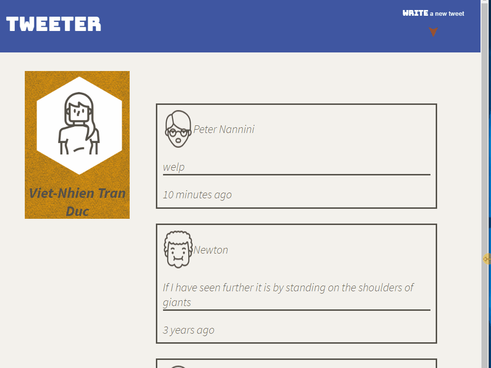
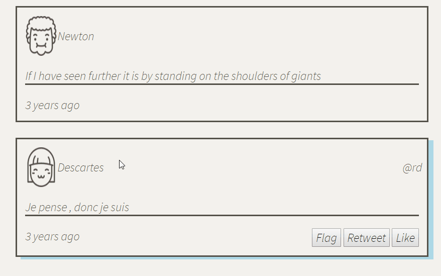
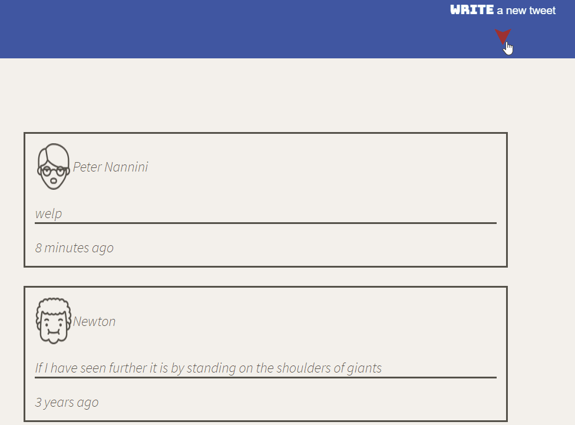
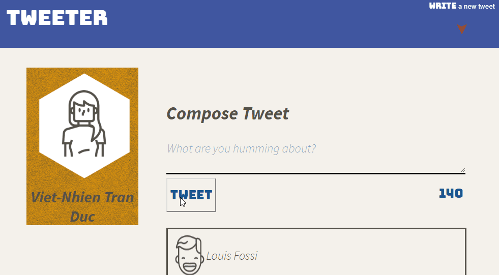

# Tweeter Project

Tweeter is a simple, single-page Twitter clone, build to practice _HTML_, _CSS_, _JS_, _jQuery_ and _AJAX_ front-end skills, and their _Node_, _Express_ and _MongoDB_ back-end skills.

# Current State
## Responsive design

## Responsive design & box shadows

## Navigation toggler

## Ajax & error chacking

## Getting Started
1. Fork or clone this repository
2. Install dependencies using the `npm install` command
3. Start the web server using the `npm run local` or `node ./server/index.js`
4. Go to <http://localhost:8080/> in your browser

## Dependencies
- Express
- Node
- body-parser
- Chance
- moment
- sass
- devDependencies
  - nodemon
 
